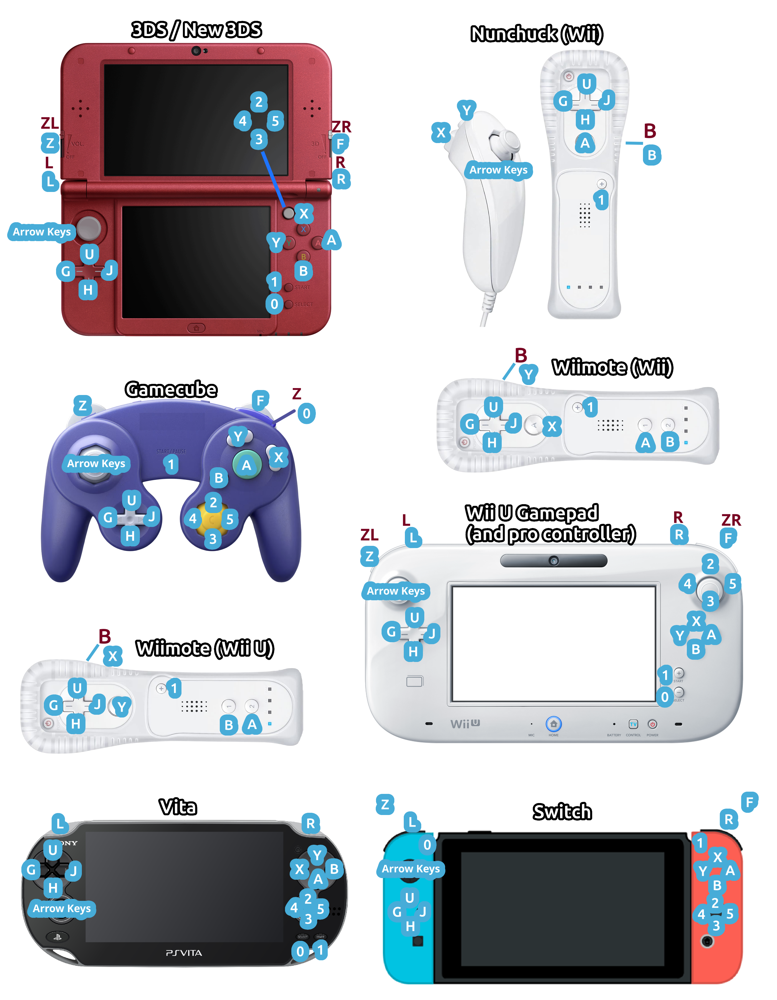

  

A work-in-progress runtime made in C++ aimed to bring most Scratch 3 projects over to 6-8th-generation console and handheld platforms (and more)!

<small>(Game shown is [Hopper Heros](https://scratch.mit.edu/projects/1184969400/) by pepper-prepper)</small>

## Controls

### Mouse

**3DS:** Glide your finger/stylus on the bottom screen to move the mouse, and tap the bottom screen to click.

**Wii U GamePad:** Use the touchscreen on the GamePad.

**Wii Remote:** Use the Wii sensor bar to control the mouse.

**PS Vita:** Use the front touchscreen.

**Other Controllers:**  Enter Mouse Mode by holding L. Use the D-pad to move the mouse, and press R to click.

## Discord Server

Join https://discord.gg/Y2gf5vZHpJ if you need any help with Scratch Everywhere! or just want to hangout.

## Unique Features

### 3DS Screen modes

- Any scratch project with an unmodified resolution setting will be displayed on the top screen only.
- If using a modded Scratch client like TurboWarp, you can go into the projects' Advanced Settings and change the resolution.
	- Setting it to `400x480` will enable both the top and bottom screen.
	- Setting it to `320x240` will enable only the bottom screen.
	- Setting it to `400x240` will make the project perfectly fit to the top screen.
	- NOTE: make sure to click `Store Settings In Project` on TurboWarp to properly apply the settings.

### Wii U Screen Modes

- Currently, projects display exactly the same on both the TV and the GamePad, and there's no way to change screen modes.

### Audio

- MP3, Ogg Vorbis, and WAV audio formats are supported.
- A sound will take time to load if playing it for the first time.
	- Known Bug: On 3DS, if a sound has to load while other sounds are playing, all sounds will stop playing until the sound is loaded.
- If you play any sound from the "Stage", the sound will play as a "Streamed Sound" and will not need to load.
- Only one "Streamed Sound" can be playing at a time, so this is good for things like background music.
- **[Wii, GameCube, Vita]** "Streamed Sound" is not supported. Any sounds in "Stage" will load and play like a normal sound.
- **[3DS, Wii, GameCube]** Sounds may fail to load if the length of the sound is too long, or if there's too many sounds loaded at once.

### Framerate

- When using a modded Scratch client like TurboWarp, you can enable the `60 FPS (Custom FPS)` advanced option, and change the FPS to any value.

### Differently Implemented Blocks

- The `Username` block returns the 3DS's nickname, and the Wii U's current Mii name.
- The `Touching __?` block uses simpler box collision, which may lead to projects working incorrectly.
- The `Stop 'All'` block brings you back to the project menu.

### Special Custom Blocks

Like TurboWarp we have special custom blocks that only work on SE! You can find a project containing and explaining them here: https://scratchbox.grady.link/project/K26OtTN2WDJ9

**Project Linking Blocks**
- `open (____) .sb3`
- `open (____) .sb3 with data (____)`
- `received data` (variable)
  
These blocks make it possible to split a big game into smaller parts (e.g. a main game, a shop, or a cutscene project) and load them as needed. All paths are relative to the `scratch-everywhere` folder, so subfolders must be specified (e.g. `MyGame/main.sb3`).
This helps avoid memory issues, keep projects modular, and makes it easier to manage large 
games.

You can find the blocks in this project: https://scratchbox.grady.link/project/twStEkSKjQaH

> [!NOTE]
> In the future, this feature may be replaced by a dedicated extension once extension support is available.

## Limitations

As this is in a very work in progress state, you will encounter many bugs, crashes, and things that will just not work. 

**List of Known Limitations:**
- Text and embedded bitmap images will not show up on vector images containing it.
- Extensions (e.g. pen and music extensions) are not yet supported.
- Some blocks may lead to crashing/unintended behavior (Please open an issue if you know of a block that's causing problems).
- Performance is poor when using many (~30+) clones (memory management issue).
- **[Wii, Switch, Vita]** Cloud Variables aren't currently supported, but likely will be in the future.
- **[Wii, Wii U, GameCube, Switch]** The first controller connected will be the only one that will work.
- **[Wii]** If you're using a PAL Wii, you must use 50Hz.
- **[GameCube]** Cloud Variables will not be supported.
- **[GameCube]** The GameCube has very little memory, so try to keep projects small.
- **[3DS]** Performace is poor when lots of blocks are running at once.
- **[3DS]** If you have a bunch of large images, some may not load.
- **[Vita]** Back touch will not be supported.

## Unimplemented blocks

- All say and think blocks
- Most costume effects;
	- Only the `Ghost` and `Brightness` costume effects are supported
- `Pitch` and `Pan left-right` sound effects
- When loudness > ___
- All color touching blocks
- Loudness

## Roadmap

### Runtime

- Bug fixing and Scratch parity
- Get all blocks working
- Pen support ([#294](https://github.com/ScratchEverywhere/ScratchEverywhere/pull/294))
- Support most TurboWarp extensions ([#210](https://github.com/ScratchEverywhere/ScratchEverywhere/pull/210))

### Wii U

- Dual screen support
- Improved controller support (multiple controllers)

### Wii

- Cloud Variable support

### Vita

- Cloud variable support (compiling with cloud variables enabled currently makes the app crash on startup)

### Other

- Download projects from the Scratch website
- Make Vector images not/less pixelated
- Browser extension send directly to device from editor

## Installation

Scratch Everywhere! is Homebrew software and requires a hacked/modded console.
There are two methods to install the runtime:
- Download the release or nightly build (easy), or
- Build the file yourself (harder)

> [!NOTE]
> Nightly builds are significantly more unstable than releases and should probably only be used if you are instructed to do so in a bug report or you know exactly what using nightlies implies.

### Get up and running for 3DS

Download the `.cia` file or `.3dsx` in the Releases tab or [nightly build](https://nightly.link/ScratchEverywhere/ScratchEverywhere/workflows/nightly-3ds/main/Scratch%20Everywhere!%203DS%20Nightly.zip).

> [!NOTE]
> Scratch Everywhere! for 3DS is also on [Universal Updater](https://db.universal-team.net/3ds/scratch-everywhere), so you can just download it there and keep it updated that way!

#### .cia (Installable app)

Place the `.cia` file in the `cias/` folder of your 3DS SD card. Open the FBI application and navigate to the `cias/` folder and install the `.cia` file. 

Put your Scratch projects in `3ds/scratch-everywhere` and open the Scratch Everywhere application on your Home screen. 

#### .3dsx

Place the `.3dsx` file in the `3ds/` folder of your 3DS SD card, put Scratch projects in `3ds/scratch-everywhere`.

Then it should be as simple as opening the Homebrew Launcher on your 3DS and running the app!

### Get up and running for Wii U

Download the `scratch-wiiu.zip` file in the Releases tab or [nightly build](https://nightly.link/ScratchEverywhere/ScratchEverywhere/workflows/nightly-wiiu/main/Scratch%20Everywhere!%20Wii%20U%20Nightly.zip).

> [!NOTE]
> Scratch Everywhere! for Wii U is also on the [Homebrew App Store](https://hb-app.store/wiiu/ScratchWiiU), so you can just download it there and keep it updated that way!

Unzip the file in your `sdcard:/wiiu/apps/` folder.

Place the scratch projects you want in `sdcard:/wiiu/scratch-wiiu/`.

Then it should be as simple as opening the app on the Wii U Menu or in the Homebrew Launcher on your Wii U!

### Get up and running for Wii

Download the `scratch-wii.zip` file in the Releases tab or [nightly build](https://nightly.link/ScratchEverywhere/ScratchEverywhere/workflows/nightly-wii/main/Scratch%20Everywhere!%20Wii%20Nightly.zip).

> [!NOTE]
> Scratch Everywhere! for Wii is also on the [Open Shop Channel](https://oscwii.org/library/app/scratch-wii), so you can just download it there and keep it updated that way!

Unzip the file and put the `apps` folder inside of the root of your SD card.

Place the Scratch projects you want in `sdcard:/apps/scratch-wii/`.

Then it should be as simple as opening the app in the Homebrew Menu on your Wii!

### Get up and running for GameCube

> [!NOTE]
> There is currently a bug on the GameCube version causing projects to not show up on the Main Menu. The GameCube release has been temporarily removed from the Releases tab until the issue is fixed. For now, you need to compile from source to use the GameCube version.

Download the `scratch-gamecube.zip` file in the Releases tab or [nightly build](https://nightly.link/ScratchEverywhere/ScratchEverywhere/workflows/nightly-gamecube/main/Scratch%20Everywhere!%20GameCube%20Nightly.zip).

Unzip the file. Put your Scratch projects in the same place you put your `.dol` file.

Then it should be as simple as opening the app on your GameCube!

### Get up and running for Nintendo Switch

Download the `scratch-nx.nro` file in the Releases tab or [nightly build](https://nightly.link/ScratchEverywhere/ScratchEverywhere/workflows/nightly-switch/main/Scratch%20Everywhere!%20Switch%20Nightly.zip).

> [!NOTE]
> Scratch Everywhere! for Nintendo Switch is also on the [Homebrew App Store](https://hb-app.store/switch/ScratchEverywhere), so you can just download it there and keep it updated that way!

Place the Scratch projects you want in `sdcard:/switch/scratch-nx/`.

Then it should be as simple as opening the app on your Nintendo Switch!

### Get up and running for Vita

> [!NOTE]
> Scratch Everywhere! for PS Vita is also on [VitaDB](https://www.rinnegatamante.eu/vitadb/#/info/1320), so you can just download it directly from your Vita using VitaDB Downloader! Do note however, the build on VitaDB might be a few versions behind.

Download the `scratch-vita.vpk` file from the releases tab or [nightly build](https://nightly.link/ScratchEverywhere/ScratchEverywhere/workflows/nightly-vita/main/Scratch%20Everywhere!%20Vita%20Nightly.zip), transfer it over to the Vita's storage, and install it using VitaShell on your Vita.

Put your Scratch Projects in `ux0:data/scratch-vita/` (you will need to create the folder yourself).

Then it should be as simple as opening and starting the app from your Vita's LiveArea homescreen!

## Building

In order to embed a Scratch project in the executable, you'll need to compile the source code.

If you would like to change the name of the app or any other information you can edit one of the Makefiles.
- **For the 3DS**, you need to edit `Makefile_3ds` and change `APP_TITLE`, `APP_DESCRIPTION` and `APP_AUTHOR` to whatever you please.
- **For the Wii U**, you need to edit `Makefile_wiiu` and change `APP_NAME`, `APP_SHORT_DESCRIPTION`, `APP_LONG_DESCRIPTION` and `APP_AUTHOR` to whatever you please.
- **For the Wii**, you need to edit `Makefile_wii` and change anything under `Application Info` to whatever you please.
- **For the Vita**, you need to edit the properties under `# METADATA/CONFIG` to whatever you please. Do note however, if you're going to use custom LiveArea images, you must run them through `pngquant` (install with your package manager) with `--posterize` set to 4 first before packaging.

#### Docker

The recommended way to compile Scratch Everywhere! is with Docker. To compile with Docker all you need installed is Docker and Buildx.

- To compile for the **3DS**, run `docker build -f docker/Dockerfile.3ds --target exporter -o . .`.

- To compile for the **Wii U**, run `docker build -f docker/Dockerfile.wiiu --target exporter -o . .`.

- To compile for the **Wii**, run `docker build -f docker/Dockerfile.wii --target exporter -o . .`.

- To compile for the **GameCube**, run `docker build -f docker/Dockerfile.gamecube --target exporter -o . .`.

- To compile for the **Nintendo Switch** run `docker build -f docker/Dockerfile.switch --target exporter -o . .`.

- To compile for the **Vita**, run `docker build -f docker/Dockerfile.vita --target exporter -o . .`.

#### Manual

If you are compiling with cloud variables, you will need to have DevkitPro's SDKs, [Mist++](https://github.com/ScratchEverywhere/mistpp), and a modified version of libcurl (instructions in mistpp-packages repo) installed.
- **For the 3DS**, you will need the DevkitARM toolchain and libctru.
	- If you want to compile with audio support, you will also need a 3DS compiled version of SDL2 and SDL2_mixer. See the [Nightly Build commands](https://github.com/ScratchEverywhere/ScratchEverywhere/blob/main/.github/workflows/nightly-3ds.yml) for a reference on how to compile SDL2 3DS for yourself.
- **For the Wii U**, you will need the DevkitPPC toolchain, WUT, all SDL2-wiiu libraries, and [libromfs-wiiu.](https://github.com/yawut/libromfs-wiiu).
- **For the Wii**, you need the DevkitPPC toolchain, libogc, all SDL2-wii libraries, and [libromfs-ogc.](https://github.com/NateXS/libromfs-ogc).
- **For the GameCube**, you need the DevkitPPC toolchain, libogc, all SDL2-gamecube libraries, and [libromfs-ogc.](https://github.com/NateXS/libromfs-ogc).
- **For the Switch**, you need the DevkitA64 toolchain, libnx, and all SDL2-switch libraries.
- **For the Vita**, all you need is the [vitasdk](https://vitasdk.org) toolchain. It includes every SDL2 thing you might need.

> [!NOTE]
> DevkitPro's install instructions are available at: https://devkitpro.org/wiki/Getting_Started

Download the source code from the releases tab and unzip it.

Make a `romfs` folder inside the unzipped source code and put the Scratch project inside of that.
- The Scratch project MUST be named `project.sb3`, all lowercase.
- For faster load times/less limitations, you can also unzip the sb3 project file and put the contents into a new folder called `project`.

Then you need to compile the projects into proper Homebrew packages.
- **For the 3DS**, you simply need to run `make`. Then copy the `Scratch-3DS.3dsx` file like you normally would.
- **For the Wii U**, you need to run `make PLATFORM=wiiu` and then copy the `build/wiiu/scratch-wiiu` folder into the `sdcard:/wiiu/apps` folder on your sd card.
- **For the Wii**, you need to run `make PLATFORM=wii package`, then find the zipped file in `build/wii/scratch-wii.zip`. Unzip it and put the `apps` folder inside the root of your Wii SD card.
- **For the GameCube**, you need to run `make PLATFORM=gamecube`, then find the `.dol` file at `build/gamecube/scratch-gamecube.dol`.
- **For the Switch**, you need to run `make PLATFORM=switch`, then find the `.nro` file at `build/switch/scratch-nx.nro`.
- **For the Vita**, run `make PLATFORM=vita`, then transfer the VPK at `build/vita/scratch-vita.vpk` over to your Vita.

#### Compilation Flags

Compilation flags are used to select which features will be enabled in the compiled version of Scratch Everywhere!. To use a compilation flag simply add it to the end of the make command (e.g. `make ENABLE_LOADSCREEN=0`).

- `ENABLE_LOADSCREEN` (default: `1`): If set to `1`, the loading screen is enabled, if set to `0` the screen is simply black during that time.
- `ENABLE_AUDIO` (default: `1`): If set to `1`, Audio will be enabled. If set to `0`, it will be disabled.
- `ENABLE_CLOUDVARS` (default: `0`): If set to `1`, cloud variable support is enabled, if set to `0` cloud variables are treated like normal variables. If your project doesn't use cloud variables, it is recommended to leave this turned off. If you run into errors while building try turning this off and see if that fixes the errors.
- **[Old 3DS]** `RAM_AMOUNT` (default: `72`): the amount of RAM, in megabytes, the old 3DS should be using. Can be set to `32`, `64`, `72`, `80`, or `96`.

## Disclaimer

This project is not affiliated with Scratch, the Scratch Team, or any of the supported platforms' parent companies or organizations.
